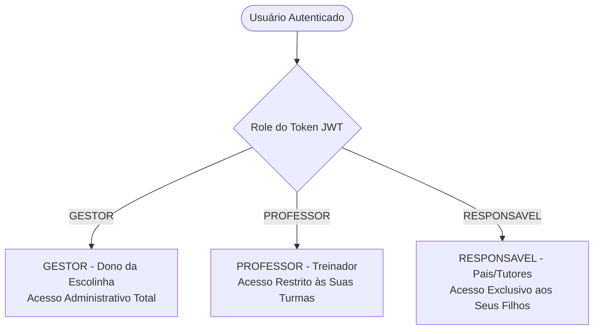

# Especificação Funcional e de Segurança - Base FC
**Projeto Acadêmico de Segurança da Informação - FICR**  
**Sistema de Gestão para Escolinhas de Futebol**

---

## 1. Visão Geral e Propósito

O **Base FC** é uma plataforma full-stack desenvolvida para centralizar a operação pedagógica, esportiva, financeira e de segurança de escolinhas de futebol. 

O sistema foi arquitetado com base na **Tríade CID (Confidencialidade, Integridade e Disponibilidade)** e nas diretrizes do **OWASP Top 10**, demonstrando na prática como controles de acesso granulares (RBAC), validação no servidor e mitigação de vulnerabilidades (IDOR, Broken Access Control e Tampering) protegem dados sensíveis de menores de idade e operações financeiras.

---

## 2. Perfis de Acesso e Matriz de Permissões (RBAC)

O sistema possui controle de acesso estrito baseado em papéis (*Role-Based Access Control*):



### Matriz de Permissões Detalhada

| Recurso / Ação | Gestor | Professor | Responsável | Justificativa de Segurança |
| :--- | :---: | :---: | :---: | :--- |
| **Cadastrar / Editar Alunos** |  Total | ❌ Proibido | ❌ Proibido | Integridade do cadastro institucional. |
| **Consultar Ficha Completa do Aluno** |  Total |  Restrito* |  Apenas Filhos | Confidencialidade de dados pessoais (LGPD). |
| **Dados Médicos e Alergias** |  Total |  Visualiza |  Apenas Filhos | Confidencialidade (Informação médica sensível). |
| **Autorização de Retirada / Emergência** |  Total |  Visualiza |  Apenas Filhos | Proteção física dos atletas menores de idade. |
| **Criar e Editar Turmas** |  Total | ❌ Proibido | ❌ Proibido | Regra de negócio administrativa. |
| **Registrar Frequência (Chamada)** |  Total |  Suas Turmas | ❌ Proibido | Operação rotineira de treino. |
| **Consultar Frequência** |  Total |  Suas Turmas |  Apenas Filhos | Transparência para os pais. |
| **Gerenciar Mensalidades & Valores** |  Total | ❌ Proibido | ❌ Proibido | Confidencialidade de dados financeiros. |
| **Dar Baixa em Pagamento** |  Total | ❌ Proibido | ❌ Proibido | Integridade transacional contra adulteração. |
| **Visualizar Mensalidades do Filho** |  Total | ❌ Proibido |  Apenas Filhos | Responsável acompanha pagamentos e pendências. |
| **Trilha de Auditoria (Audit Logs)** |  Exclusivo | ❌ Proibido | ❌ Proibido | Não-repúdio e auditoria de segurança. |

*\* O Professor só pode visualizar os alunos matriculados nas turmas em que ele é o professor responsável.*

---

## 3. Módulos do Sistema e Regras de Negócio

### 3.1. Cadastro de Alunos (Atletas)
* **Dados Pessoais**: Nome completo, data de nascimento, CPF, telefone de contato, endereço residencial, foto e data de matrícula.
* **Dados Esportivos**: Categoria (`Sub-7`, `Sub-9`, `Sub-11`, `Sub-13`, `Sub-15`, `Sub-17`), Posição preferida, Pé dominante (`DIREITO`, `ESQUERDO`, `AMBIDESTRO`), Número da camisa.
* **Status**: `ATIVO`, `INATIVO`, `TRANCADO`.
* **Vínculo de Turma**: Cada aluno pode ser vinculado a uma turma compatível com a sua categoria.

### 3.2. Responsáveis (Guardians)
* **Separação Cadastral**: O aluno é a entidade esportiva; o responsável é a entidade civil e financeira.
* **Vínculo 1:N**: Um aluno pode ter responsável principal e responsável secundário.
* **Campos**: Nome, CPF, Telefone WhatsApp, E-mail e Grau de Parentesco (Pai, Mãe, Avô/Avó, Tutor legal).

### 3.3. Contatos de Emergência e Autorização de Retirada
* **Campos**: Nome, telefone, relação/parentesco.
* **Flags Críticas**:
  * `is_main`: Contato prioritário para emergências.
  * `authorized_pickup`: **Autorizado a buscar o aluno na escolinha (SIM/NÃO)**.
* **Regra de Negócio e Segurança**: Apenas pessoas expressamente cadastradas e com autorização registrada na ficha do aluno podem retirá-lo após o treino.

### 3.4. Informações Médicas e Confidencialidade (LGPD)
* **Dados Sensíveis**: Alergias a medicamentos ou alimentos, restrições físicas para exercícios, medicamentos de uso contínuo e contato do médico/plano de saúde.
* **Justificativa de Segurança (Tríade CID - Confidencialidade)**: Dados de saúde são classificados como dados sensíveis. O sistema bloqueia a visualização para qualquer usuário não autorizado e restringe o professor ao estritamente necessário para socorro imediato no campo.

### 3.5. Turmas e Regra de Capacidade Máxima
* **Campos**: Nome da turma (ex: `Sub-13 A`), Categoria, Professor responsável, Dias de treino (ex: Segunda e Quarta), Horário (início e término), Local/Campo, Limite máximo de alunos (capacidade).
* **Regra de Integridade no Backend**:
  ```text
  SE quantidade_alunos_matriculados >= capacidade_turma:
      BLOQUEAR MATRÍCULA (HTTP 400: "Turma atingiu a capacidade máxima de X alunos.")
  ```
  *Essa validação ocorre obrigatoriamente no servidor (Express + PostgreSQL), e não apenas na interface visual.*

### 3.6. Professores / Treinadores
* **Campos**: Nome completo, CPF, telefone, e-mail, especialidade (ex: Preparação de Goleiros, Técnico Principal, Preparador Físico) e status (`ATIVO`/`INATIVO`).
* **Associação**: Um professor pode lecionar para uma ou mais turmas.

### 3.7. Controle de Frequência (Chamada nos Treinos)
* **Operação**: O professor ou gestor abre a chamada selecionando a Turma e a Data do treino.
* **Status por Aluno**: `PRESENTE`, `AUSENTE`, `JUSTIFICADO`.
* **Métricas Automáticas na Ficha do Aluno**:
  * Total de treinos realizados.
  * Presenças e faltas.
  * Taxa de frequência percentual (ex: `90% de presença`).

### 3.8. Módulo Financeiro & Mensalidades (Integridade CID)
* **Registros de Mensalidade**: Competência (Mês/Ano), Valor, Data de Vencimento, Data de Pagamento, Forma de Pagamento e Status (`PENDENTE`, `PAGO`, `ATRASADO`, `CANCELADO`).
* **Demonstração Prática de Integridade (Anti-Tampering)**:
  * O navegador do cliente **NUNCA** envia o valor a ser pago ou o novo status arbitrariamente (ex: `{ "valor": 1.00, "status": "PAGO" }` é rejeitado).
  * O cliente envia apenas o identificador da cobrança e o método: `{ "paymentId": "...", "paymentMethod": "PIX" }`.
  * O backend consulta o valor oficial no banco de dados, valida a permissão da Role (`GESTOR`) e efetua a baixa, registrando a data e o responsável na trilha de auditoria.

### 3.9. Ficha Centralizada do Atleta (Visão 360°)
Ao selecionar um aluno, o sistema exibe uma interface unificada em abas:
1. **Dados Gerais**: Informações cadastrais e dados esportivos (camisa, pé dominante, posição).
2. **Responsáveis & Retirada**: Lista de responsáveis e contatos autorizados para retirada do menor.
3. **Saúde & Emergência**: Alergias, cuidados médicos e telefones de emergência.
4. **Frequência**: Gráfico/histórico de presenças por treino e taxa de assiduidade.
5. **Mensalidades**: Histórico financeiro com status das mensalidades.

### 3.10. Dashboard Executivo do Gestor
Painel centralizado com indicadores em tempo real:
* **Cards de KPIs**: Alunos Ativos, Turmas Abertas, Mensalidades Atrasadas e Receita Recebida no Mês.
* **Gráfico / Resumo Financeiro**: Total de mensalidades Pagas vs. Pendentes vs. Atrasadas.
* **Agenda do Dia**: Treinos programados para a data com horário, categoria e campo.

---

## 4. Alinhamento com a Tríade CID

| Pilar | Mecanismos Implementados no Base FC |
| :--- | :--- |
| **Confidencialidade** | • Autenticação JWT criptográfica (Supabase Auth).<br>• Middlewares RBAC (`requireRole`) e Proteção contra IDOR (`checkStudentAccess`).<br>• Isolamento de dados médicos e contatos autorizados.<br>• Row Level Security (RLS) no PostgreSQL. |
| **Integridade** | • Validação de esquemas rígidos no servidor com Zod.<br>• Validação de capacidade máxima de turmas no backend.<br>• Baixa financeira segura (anti-tampering de valores pelo client).<br>• Trilha de Auditoria inalterável (`audit_logs`) para todas as ações críticas. |
| **Disponibilidade** | • Rate Limiting (100 reqs/15 min por IP) contra força bruta e DoS.<br>• Helmet configurando cabeçalhos de segurança HTTP.<br>• Tratamento global de erros sem vazamento de stack traces internos. |

---

## 5. Roteiro de Implementação em Fases

1. **Fase 1**: Banco de dados (adequação de campos médicos, endereço e fotos em `schema.sql`).
2. **Fase 2**: Backend API (rotas, controllers e validators de Turmas, Professores, Frequência, Mensalidades e Auditoria).
3. **Fase 3**: Ficha 360° do Aluno e Formulário de Matrícula Completo com Contatos e Saúde.
4. **Fase 4**: Módulo de Turmas & Chamada de Treinos.
5. **Fase 5**: Módulo Financeiro & Dashboard com Métricas Reais.
6. **Fase 6**: Painel Visual de Segurança & Trilha de Auditoria.
