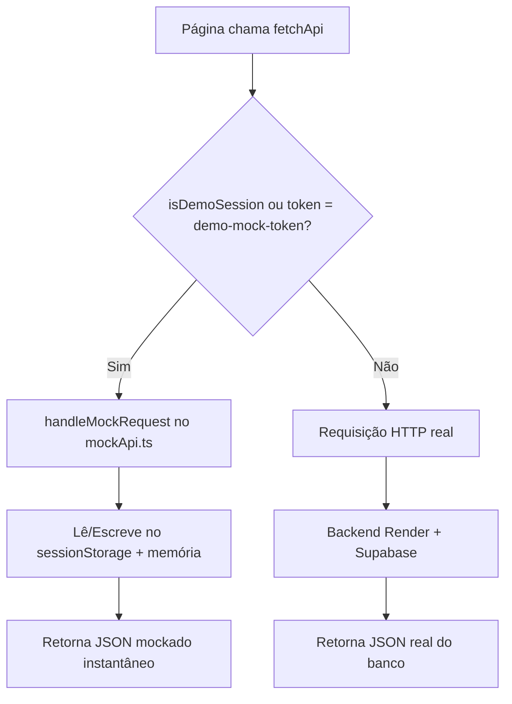
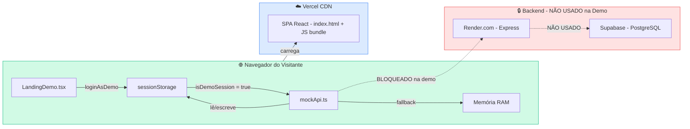

# 🏟️ BASE FC — Ambiente de Demonstração (Homologação Pública)

> Documento técnico que descreve como funciona e como publicar o **Modo Demonstração**
> do Base FC para apresentação no LinkedIn e avaliação por visitantes externos.

---

## 1. Visão Geral

O Ambiente de Demonstração permite que qualquer pessoa acesse o sistema Base FC
**sem criar conta e sem depender de banco de dados**. Todos os dados são fictícios,
armazenados em memória (RAM) e `sessionStorage` do navegador do visitante.

### Benefícios

| Benefício | Descrição |
|---|---|
| **Zero risco de dados** | Nenhum visitante altera dados reais — tudo é mockado localmente |
| **Sem cold start** | Não depende do backend no Render (que pode hibernar) |
| **Sem cadastro** | Visitante clica e entra — sem formulários, sem e-mail |
| **Isolamento por sessão** | Cada visitante tem seu próprio "banco" em `sessionStorage` |
| **Resetável** | Botão "Reiniciar Dados" restaura tudo ao estado original |

---

## 2. Fluxo do Visitante

```
┌─────────────────────────────────────────────────────┐
│                PÁGINA INICIAL (/)                   │
│                                                     │
│                    BASE FC                          │
│          Gestão inteligente para                    │
│            escolinhas de futebol                    │
│                                                     │
│           [ ACESSAR DEMONSTRAÇÃO ]                  │
│                                                     │
│  (scroll suave para a seção de personas)            │
└────────────────────┬────────────────────────────────┘
                     │
                     ▼
┌─────────────────────────────────────────────────────┐
│           AMBIENTE DE DEMONSTRAÇÃO                  │
│                                                     │
│   Todos os dados apresentados são fictícios.        │
│   Nenhuma criação de conta é necessária.            │
│                                                     │
│  ┌────────────────────┐  ┌────────────────────┐    │
│  │      Gestor         │  │    Responsável      │   │
│  │      🛡️              │  │    ❤️                │  │
│  │                     │  │                     │   │
│  │  Dashboard          │  │  Portal do Filho    │   │
│  │  Receitas e Métricas│  │  Frequência         │   │
│  │  Turmas & Treinos   │  │  Mensalidades       │   │
│  │  Mensalidades       │  │  Turmas e Horários  │   │
│  │  Auditoria CID      │  │                     │   │
│  │                     │  │                     │   │
│  │     [ENTRAR]        │  │     [ENTRAR]        │   │
│  └────────────────────┘  └────────────────────┘    │
└────────────────────┬────────────────────────────────┘
                     │
                     ▼
┌─────────────────────────────────────────────────────┐
│         SISTEMA COMPLETO (Layout + Outlet)          │
│                                                     │
│  ┌──── DemoBanner (topo fixo) ────────────────┐     │
│  │ 🟢 Ambiente de Demonstração                │     │
│  │ [Gestor] [Responsável]                     │     │
│  │                  [Reiniciar] [Sair da Demo] │     │
│  └────────────────────────────────────────────┘     │
│                                                     │
│  ┌─ Sidebar ─┐  ┌──── Conteúdo ────────────┐       │
│  │ Dashboard │  │                           │       │
│  │ Atletas   │  │  (páginas reais do        │       │
│  │ Turmas    │  │   sistema, alimentadas    │       │
│  │ etc.      │  │   por dados mockados)     │       │
│  └───────────┘  └───────────────────────────┘       │
└─────────────────────────────────────────────────────┘
```

### Detalhamento passo-a-passo

1. **Visitante acessa a URL** (ex: `basefc.vercel.app`) → como não está autenticado, o componente `HomeOrLanding` renderiza a `LandingDemo`.
2. **Clica em "ACESSAR DEMONSTRAÇÃO"** → scroll suave até a seção de personas.
3. **Escolhe um perfil** (Gestor ou Responsável) → a função `loginAsDemo(role)` do `AuthContext`:
   - Cria um **usuário sintético** (objeto `User` do Supabase, sem chamada ao banco).
   - Salva a sessão no `sessionStorage` (chave `basefc_demo_session`).
   - Inicializa um **data store** local com dados fictícios (chave `basefc_demo_data_v1`).
4. **Navega pelo sistema** → toda chamada `fetchApi()` detecta que é uma sessão demo (`isDemoSession()` ou `token === 'demo-mock-token'`) e roteia para o `handleMockRequest()` em vez de fazer HTTP real.
5. **Banner persistente** (`DemoBanner`) fica no topo permitindo:
   - Alternar entre perfis sem sair.
   - Reiniciar os dados fictícios ao estado original.
   - Sair da demonstração.

---

## 3. Arquitetura Técnica (Já Implementada)

### 3.1 Componentes e Arquivos Envolvidos

```
src/
├── pages/
│   └── LandingDemo.tsx          ← Landing page pública com hero + cards de persona
├── components/
│   ├── DemoBanner.tsx            ← Banner fixo no topo durante sessão demo
│   └── Layout.tsx                ← Layout principal (renderiza DemoBanner + Sidebar + Outlet)
├── contexts/
│   └── AuthContext.tsx           ← Gerencia estado de autenticação (real + demo)
├── services/
│   ├── api.ts                    ← Proxy de requisições: real ou mock
│   ├── mockApi.ts                ← Roteador de endpoints mockados (884 linhas)
│   ├── mockData.ts               ← Dados fictícios iniciais (597 linhas)
│   └── supabase.ts               ← Client Supabase (usado apenas no login real)
└── App.tsx                       ← Rotas: / → HomeOrLanding, /demo → LandingDemo
```

### 3.2 Diagrama de Decisão de Roteamento de Dados



### 3.3 Entidades Mockadas

| Entidade | Quantidade | Arquivo |
|---|---|---|
| Alunos (Students) | 8 atletas | [mockData.ts](file:///home/luandev/Documentos/projSegurancaFICR/baseFc/src/services/mockData.ts#L232-L448) |
| Professores (Teachers) | 3 treinadores | [mockData.ts](file:///home/luandev/Documentos/projSegurancaFICR/baseFc/src/services/mockData.ts#L124-L167) |
| Turmas (Classes) | 4 turmas (Sub-9 a Sub-15) | [mockData.ts](file:///home/luandev/Documentos/projSegurancaFICR/baseFc/src/services/mockData.ts#L169-L230) |
| Mensalidades (Payments) | 8 cobranças | [mockData.ts](file:///home/luandev/Documentos/projSegurancaFICR/baseFc/src/services/mockData.ts#L450-L533) |
| Presenças (Attendance) | 9 registros | [mockData.ts](file:///home/luandev/Documentos/projSegurancaFICR/baseFc/src/services/mockData.ts#L535-L545) |
| Logs de Auditoria | 4 logs CID | [mockData.ts](file:///home/luandev/Documentos/projSegurancaFICR/baseFc/src/services/mockData.ts#L547-L596) |

### 3.4 Endpoints Mockados (mockApi.ts)

| Endpoint | Métodos | Funcionalidade |
|---|---|---|
| `/dashboard` | GET | Dashboard do gestor ou portal do responsável |
| `/students` | GET, POST | Listar e cadastrar alunos |
| `/students/:id` | GET, PUT, DELETE | Detalhar, editar, excluir aluno |
| `/students/:id/profile` | GET | Perfil completo com guardião e emergência |
| `/classes` | GET, POST | Listar e criar turmas |
| `/classes/:id` | GET, PUT, DELETE | Detalhar, editar, excluir turma |
| `/classes/:id/students` | GET, POST | Alunos da turma / Enturmar |
| `/classes/:id/enroll/:studentId` | DELETE | Desenturmar aluno |
| `/attendance/class/:classId` | GET | Chamada de presença por turma/data |
| `/attendance` | POST | Registrar chamada |
| `/payments` | GET, POST | Listar e criar cobranças |
| `/payments/batch` | POST | Gerar lote de mensalidades |
| `/payments/:id/pay` | POST | Confirmar pagamento |
| `/payments/:id` | DELETE | Cancelar cobrança |
| `/audit` | GET | Logs de auditoria CID |

### 3.5 Perfis Disponíveis

| Perfil | E-mail Fictício | Nome Exibido | Acesso |
|---|---|---|---|
| **Gestor** | carlos.diretor@basefc.com | Prof. Carlos Eduardo (Coordenador Geral) | Dashboard, Atletas, Matricular, Turmas, Mensalidades, Professores, Auditoria |
| **Responsável** | ana.souza@email.com | Ana Paula Souza (Responsável) | Portal do Aluno (filho: Lucas Souza) |

---

## 4. Estratégia de Deploy para Homologação Pública

### 4.1 Plataforma: Vercel (Frontend-Only)

O ambiente de demonstração **não precisa do backend**. O deploy na Vercel serve apenas o frontend estático (SPA React), e toda interação de dados é resolvida em memória.

```
Deploy Flow:
  GitHub push → Vercel auto-build → vite build → SPA servida em CDN global
```

### 4.2 Configurações Necessárias

#### Vercel — Environment Variables

| Variável | Valor |
|---|---|
| `VITE_SUPABASE_URL` | URL do projeto Supabase (necessário para não quebrar import) |
| `VITE_SUPABASE_ANON_KEY` | Chave anon do Supabase |
| `VITE_API_URL` | URL do backend no Render (usado apenas no login real) |

> [!NOTE]
> Mesmo que as variáveis do Supabase estejam definidas, o modo demo **nunca faz chamadas ao Supabase**.
> O `api.ts` intercepta tudo antes de chegar ao `fetch()`.

#### Vercel — vercel.json (já configurado)

```json
{
  "rewrites": [
    {
      "source": "/api/:path*",
      "destination": "https://basefc.onrender.com/api/:path*"
    },
    {
      "source": "/(.*)",
      "destination": "/index.html"
    }
  ]
}
```

> O rewrite de `/api` só é usado quando alguém faz login real (email + senha).
> No modo demo, essa rota nunca é acionada.

### 4.3 Segurança do Ambiente Demo

| Proteção | Como funciona |
|---|---|
| **Isolamento por sessão** | Cada visitante tem seu próprio `sessionStorage` — as ações de um não afetam outro |
| **Sem persistência** | Fechar a aba = perder dados alterados. Não há `localStorage` para dados demo |
| **Sem acesso ao banco real** | Toda chamada é interceptada antes de sair do navegador |
| **Dados resetáveis** | Botão "Reiniciar Dados" no `DemoBanner` restaura o estado original |
| **Sem credenciais expostas** | O token demo é `demo-mock-token` (string fixa, não é um JWT válido) |

---

## 5. Ajustes Recomendados Antes de Publicar

### 5.1 Experiência do Visitante

| # | Ajuste | Status | Prioridade |
|---|---|---|---|
| 1 | Landing page como rota `/` quando não autenticado | ✅ Já implementado (`HomeOrLanding`) | — |
| 2 | Cards de 2 personas (Gestor + Responsável) | ✅ Já implementado (`LandingDemo`) | — |
| 3 | Banner demo com alternador de perfis (2 perfis) | ✅ Já implementado (`DemoBanner`) | — |
| 4 | Link "Login com Senha" na landing para acesso real | ✅ Já implementado | — |
| 5 | **Meta tags SEO/OG** para compartilhamento no LinkedIn | ⚠️ Pendente | Alta |
| 6 | **Favicon e OG Image** para preview rico no LinkedIn | ⚠️ Pendente | Alta |
| 7 | **Indicador visual "DEMO"** no título da aba | ⚠️ Pendente | Média |

### 5.2 Meta Tags para LinkedIn (Open Graph)

Adicionar no [index.html](file:///home/luandev/Documentos/projSegurancaFICR/baseFc/index.html):

```html
<!-- Open Graph (LinkedIn, Facebook, WhatsApp) -->
<meta property="og:type" content="website" />
<meta property="og:title" content="Base FC — Gestão Inteligente para Escolinhas de Futebol" />
<meta property="og:description" content="Sistema completo de gestão esportiva com controle de atletas, turmas, presenças, mensalidades e portal do responsável. Demonstração aberta ao público." />
<meta property="og:image" content="https://SEU-DOMINIO.vercel.app/og-image.png" />
<meta property="og:url" content="https://SEU-DOMINIO.vercel.app" />
<meta property="og:site_name" content="Base FC" />

<!-- Twitter Card -->
<meta name="twitter:card" content="summary_large_image" />
<meta name="twitter:title" content="Base FC — Gestão de Escolinhas de Futebol" />
<meta name="twitter:description" content="Acesse a demonstração gratuita e explore o sistema completo." />
<meta name="twitter:image" content="https://SEU-DOMINIO.vercel.app/og-image.png" />
```

### 5.3 Título da Aba no Modo Demo

Adicionar um `useEffect` no [Layout.tsx](file:///home/luandev/Documentos/projSegurancaFICR/baseFc/src/components/Layout.tsx) ou no `App.tsx`:

```tsx
useEffect(() => {
  if (isDemo) {
    document.title = '🟢 Base FC — Demonstração';
  } else {
    document.title = 'Base FC — Gestão Esportiva';
  }
}, [isDemo]);
```

---

## 6. O que o Visitante Pode Fazer na Demo

### Perfil Gestor (acesso total)

- ✅ Ver dashboard com métricas (receita, alunos ativos, inadimplência)
- ✅ Listar, buscar e filtrar atletas
- ✅ Cadastrar um novo atleta (com guardião e contato de emergência)
- ✅ Editar dados de um atleta existente
- ✅ Excluir um atleta
- ✅ Ver perfil completo do atleta (ficha médica, turmas, pagamentos)
- ✅ Criar, editar e excluir turmas
- ✅ Enturmar e desenturmar alunos
- ✅ Registrar chamada de presença
- ✅ Gerar mensalidades em lote
- ✅ Confirmar pagamento (baixa manual)
- ✅ Cancelar cobrança
- ✅ Cadastrar, editar e excluir professores
- ✅ Consultar trilha de auditoria (CID - Confidencialidade, Integridade, Disponibilidade)

### Perfil Responsável

- ✅ Ver portal do aluno (dados do filho: Lucas Souza)
- ✅ Acompanhar frequência (presenças, faltas, justificativas)
- ✅ Ver situação financeira (mensalidades pagas, pendentes, atrasadas)
- ✅ Ver turmas e horários de treino
- ❌ Não acessa nenhuma funcionalidade de gestão

---

## 7. Checklist de Deploy

```
PRÉ-DEPLOY
  [ ] Atualizar meta tags OG no index.html
  [ ] Criar imagem OG (1200x630px) para preview do LinkedIn
  [ ] Confirmar variáveis de ambiente na Vercel
  [ ] Testar build local: npm run build
  [ ] Testar os 2 perfis (Gestor e Responsável) no build local

DEPLOY
  [ ] Push para branch main
  [ ] Verificar build automático na Vercel
  [ ] Testar URL pública em aba anônima

PÓS-DEPLOY
  [ ] Verificar preview do link no LinkedIn (usar LinkedIn Post Inspector)
  [ ] Testar em mobile (iPhone/Android)
  [ ] Testar alternância de perfis no DemoBanner
  [ ] Testar botão "Reiniciar Dados"
  [ ] Validar que login real (email/senha) continua funcionando
```

---

## 8. Resumo da Arquitetura de Proteção



> [!IMPORTANT]
> **O backend e o banco de dados reais nunca são acessados durante a demonstração.**
> Toda a lógica roda exclusivamente no navegador do visitante.

---

## 9. Estrutura de URLs

| URL | O que aparece | Autenticação |
|---|---|---|
| `/` | Landing Demo (se não logado) ou Dashboard (se logado) | Nenhuma / Demo / Real |
| `/demo` | Landing Demo (rota direta) | Nenhuma |
| `/login` | Tela de login real (email + senha) | Nenhuma |
| `/alunos` | Lista de atletas | Demo ou Real |
| `/alunos/novo` | Formulário de matrícula | Demo ou Real (Gestor) |
| `/turmas` | Turmas e treinos | Demo ou Real |
| `/mensalidades` | Painel financeiro | Demo ou Real (Gestor) |
| `/professores` | Gestão de professores | Demo ou Real (Gestor) |
| `/auditoria` | Trilha de auditoria CID | Demo ou Real (Gestor) |

---

*Documento gerado em Setembro/2026 — Base FC v1.0*
